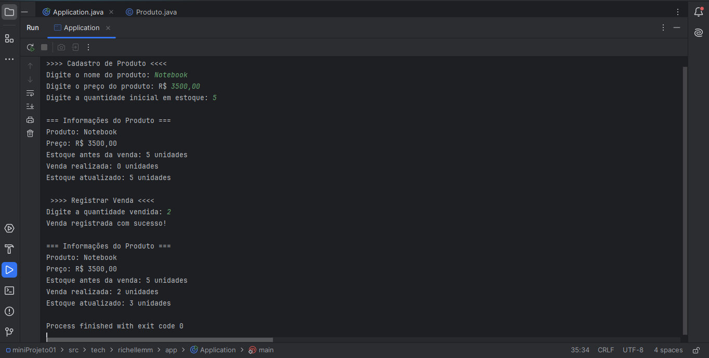

# Olá, sejam bem-vindos! :wave:

MINI PROJETO PARA A MARCO VA01 - PROF ANGELO

 

 

## Sobre :books:
- Sou **Richelle Monteiro**, estudante de Sistemas para Internet no Centro Universitário - UNIESP (3º período);
- Esse projeto é destinado à avaliaçao da disciplina Padrões de Projeto;

## Recursos Utilizados :diamonds:

- Git
- GitHub
- IntelliJ Idea
- Linguagem: JAVA

### Resultado do console :key:

